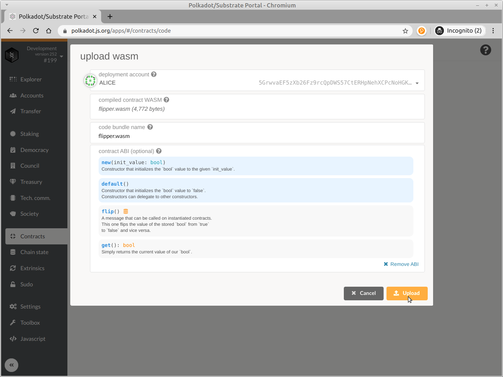
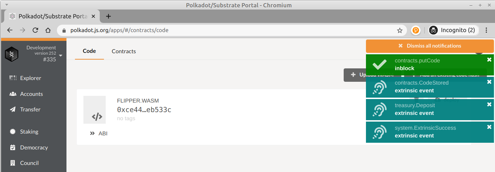
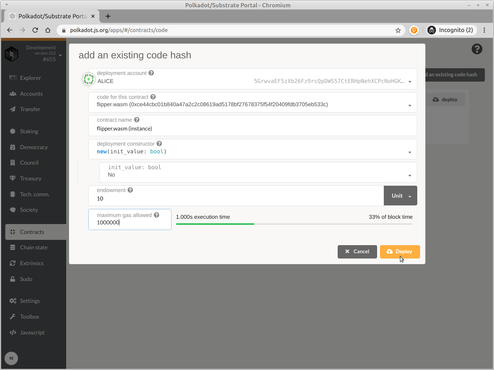
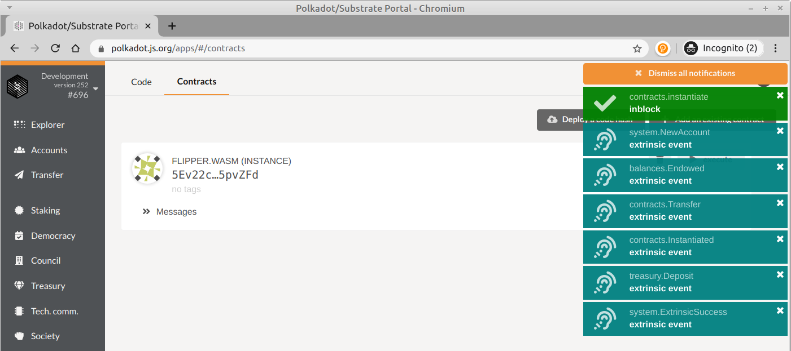

# 部署合约

现在我们已经从源代码生成了Wasm二进制文件并启动了Substrate节点，我们希望将此合同部署到我们的Substrate区块链上。

Substrate上的智能合约部署与传统智能合约区块链上的部署有些不同。

每次您在其他平台上推送合同时，都会部署一个全新的智能合同源代码块，而Substrate选择优化此行为。例如，标准ERC20令牌已部署到以太坊数千次，有时仅更改初始配置（通过Solidity构造函数）。这些实例中的每一个都在区块链上占用相当于合同源代码大小的空间，即使实际上没有更改任何代码。

在Substrate中，合同部署过程分为两个部分：

1-将您的代码放在区块链上

 2-创建合同实例 

通过这种模式，可以将诸如ERC20标准之类的合同代码一次性放置在区块链上，但可以实例化任意次。无需持续上传相同的源代码并浪费区块链上的空间。

### 将您的代码放在区块链上

在您的Substrate开发节点运行后，您可以返回Polkadot UI，在其中您可以与您的区块链进行交互。

打开用户界面的特殊设计的“合同”部分。

在“代码”部分中，选择“上载Wasm”。

在弹出窗口中，选择一个具有一定帐户余额的部署帐户，例如Alice。 在已编译的合同WASM中，选择我们生成的flipper.wasm文件。 对于合同的元数据，选择JSON文件。

在按下“上载并签名并提交”外部符号之后，将形成一个新块，并使用Contracts.PutCode发出系统事件。 如果交易成功，您将获得一个system.ExtrinsicSuccess事件，您的WASM合同将存储在您的Substrate区块链上！

注意：如果收到system.ExtrinsicFailed错误消息，则可能是您没有足够的燃料来执行该调用。 您可以通过查看终端中的日志来验证这是原因。 这可能会在此或任何后续合约实例化或调用中发生。

### 创建一个合约实例

智能合约作为区块链上账户系统的扩展而存在。 因此，创建此合约的实例将创建一个新的AccountId，该ID将存储由智能合同管理的任何余额并允许我们与合同进行交互。

您会在“代码”选项卡上注意到一个代表我们的智能合约的新对象。 现在，我们需要部署智能合约来创建实例。 按下flipper合约上的“部署”按钮。

要实例化我们的合约，我们只需要给此合约帐户一个10个单位的捐赠才能支付存储租金，然后再次将允许的最大天然气价值设置为（1,000,000）：

注意：如前所述，合约创建涉及创建新帐户。 因此，您必须确保至少为合约账户提供区块链定义的存入保证金。 我们还需要能够支付合同的租金（捐赠）。 如果我们用完所有这笔定金，合约将无效。 我们总是可以补充合约的余额并保持其链上状态。

当您按Deploy时，应该会看到一系列事件，包括创建新帐户（system.NewAccount）和合约实例化（contracts.instantiate）：

