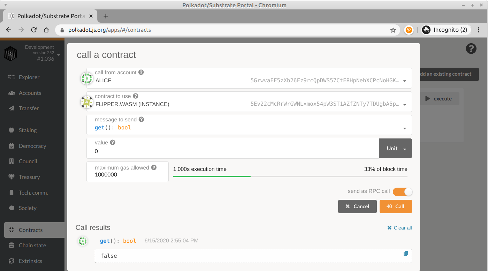
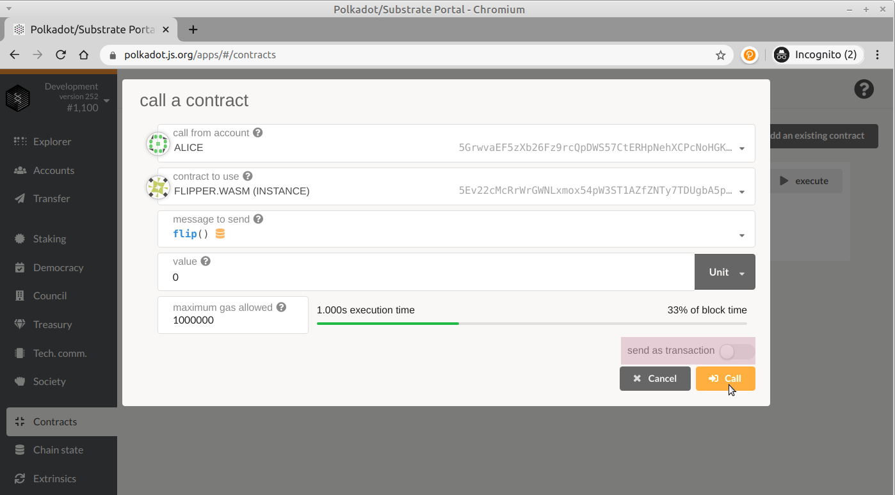
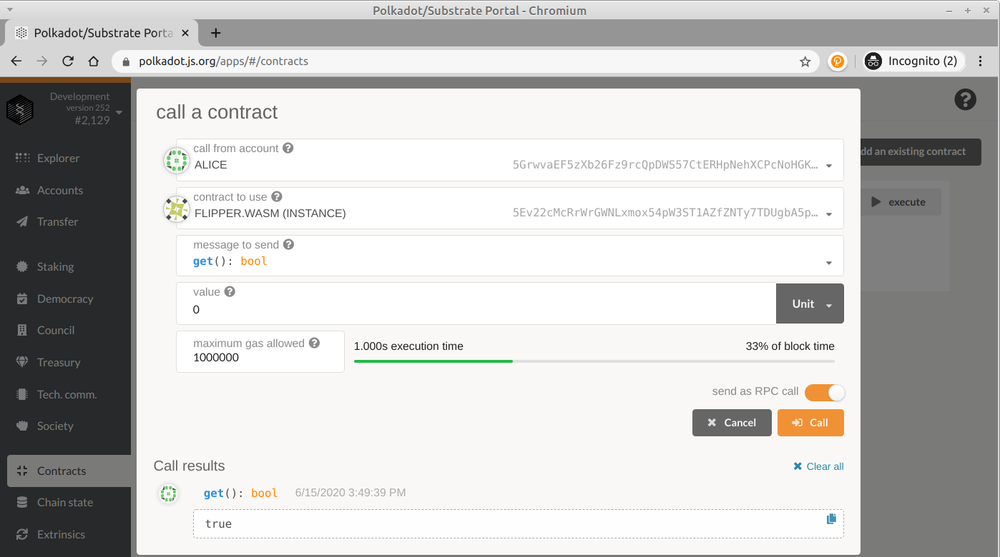

# 调用合约

现在您的合同已被完全部署，我们可以开始与它进行交互了！ Flipper只有两个功能，因此我们将向您展示同时使用这两个功能的感觉。

get\(\)

如果您回顾一下合同的on\_deploy（）函数，我们会将Flipper合约的初始值设置为false。 让我们检查一下是否是这种情况。

在“合同”部分，按“执行”按钮：


设置要发送到get（）的消息：bool。 将允许的最大燃料值设置为1,000,000。

当您按“呼叫”时，您将看到它返回值false：



注意：您可能想知道：“为什么从合同中读取值时需要指定燃料？”

如果您注意到“调用”按钮的正上方，则有一个切换开关，可让您“将事务发送为交易”或“作为RPC调用发送”。 对于这样的只读请求，我们可以简单地使用RPC调用来模拟事务，但实际上不将任何内容存储在链上。 因此，您仍然需要指定正确的燃料量来支付“虚拟费用”，但是不用担心，以这种方式拨打电话不会收取任何费用。 :\)

### flip\(\)

因此，让我们现在使价值变为现实！

我们可以使用UI发送的替代消息是flip（）。 同样，将允许的最大燃料值设置为1,000,000。



您会注意到该调用实际上发送了一个事务。 如果交易成功，那么我们应该能够返回到get（）函数并查看更新后的存储：



哇哦！ 您部署了第一个智能合约！

### 前进！

我们将不再重复这些设置和部署步骤，而是在整个教程中使用它们。 如果您需要记住如何执行某个过程，可以随时返回本章。

本教程的其余部分将包含模板代码，您将使用它们来完成合约开发的不同步骤。 每个模板都带有一套完整设计的测试套件，如果您对合同进行了正确的编程，则该套件应通过。 在继续操作之前，请确保运行：


```text
cargo +nightly test
```

并且测试全部成功执行，没有任何警告。

您无需在每个部分之间部署合约，但是如果我们要求您部署合约，则需要遵循与Flipper合约相同的步骤。

