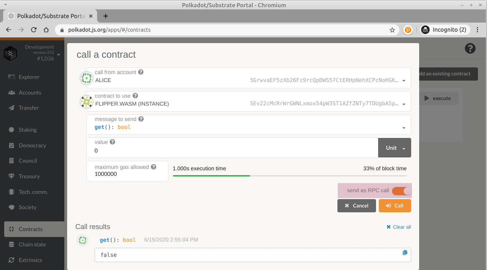

# 故障排除

以下是您可能遇到的一些常见问题的解决方案：

### 意外的事情变化

运行substrate链上的区块生产（BABE）存在一个已知问题。 如果节点停止时间太长（关闭终端，使计算机进入睡眠状态等），则会出现以下错误：

```text
ClientImport("Unexpected epoch change")
```

为了解决这个问题，您将需要使用以下命令重置节点：substrate purge-chain --dev。 届时，您将需要重新部署所有合同，并重新执行之前在节点上可能已完成的所有步骤。 只要保持节点运行，就不会遇到任何问题。

### 本地存储中的旧合同

Polkadot UI使用其自己的本地存储来跟踪您已部署的合同。 这意味着，如果您使用UI部署合同，然后清除Substrate节点，即使链中不存在旧合同，您仍会在UI中看到旧合同！

您可以简单地从UI中删除任何旧工件，或者重置本地存储。 因此请记住，在清除链时，您将需要重新部署所有合同，并重新执行之前在节点上可能已完成的所有步骤。

### 事务与RPC

使用Polkadot UI与合同进行交互时，您可以选择将呼叫作为事务或通过RPC提交：




当您作为交易发送时，它应该完全符合您的期望。 交易提交给合约，从您的帐户中扣除费用，并且区块链的状态可以更改。 在这些情况下，合约调用不会返回任何值，只会显示“成功”或“失败”外部消息以及您发出的任何事件。

但是，有些呼叫可能要“测试”，而不是实际提交事务。 或者，您可能想偷看如果调用了合约函数将返回的值。 对于这些情况，您可以提交RPC调用，该调用将运行所有合约逻辑，但实际上不提交事务或更新链的状态。 但是，您仍然需要指定正确的燃料来支付“虚拟费”，但是不用担心，以这种方式拨打电话不会收取任何费用。 :\)

### 合同状态租金

Substrate合约模块具有状态租金系统，如果合约希望保留在区块链上，则可以强制其保留资金。 这意味着您使用合约的次数越多，从中收取的费用就越多，并且在某个时候，合约将用光费用，并变成无法正常运行的墓碑。 为了避免这种情况，我们在最初部署合同时会给它大量的捐赠。 但是，如果您的合约确实成为墓碑，就本教程而言，最好的解决方案是将您的合同重新部署到链中。

通常，防止这种情况的最佳方法是确保合约资金充足。 在现实世界中，您可以通过一个过程来恢复逻辑删除契约并使它再次运行，但是这超出了本教程的范围。

### 其他事宜

如果在本教程中遇到其他任何问题，请报告问题！

