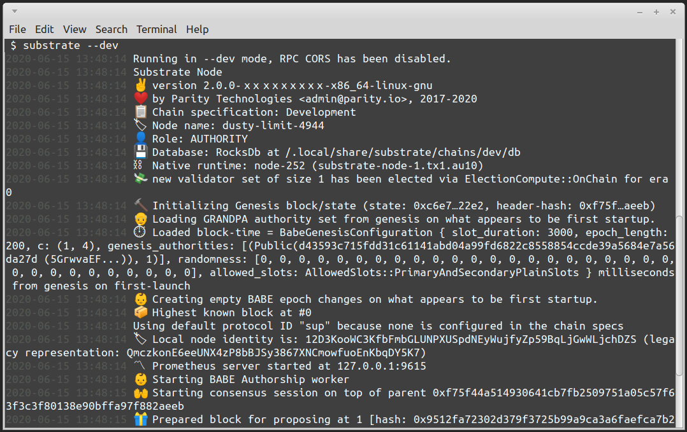
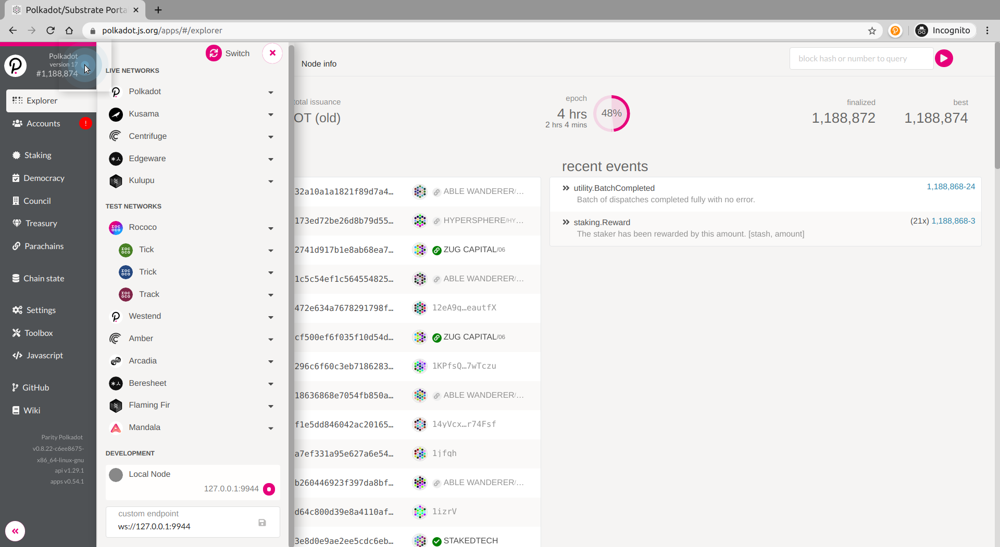
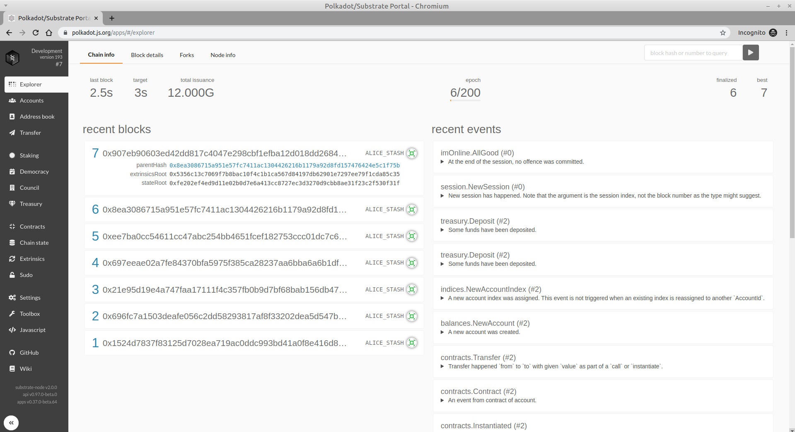

# 运行一个Substrate节点

成功安装Substrate后，可以通过运行以下命令启动本地开发链：

```text
substrate --dev
```

注意：如果您过去曾经运行过此命令，则可能要清除链条，以使本教程顺利进行。 您可以使用以下命令`substrate purge-chain --dev`轻松完成此操作。



您应该开始在终端中看到节点所产生的区块。

您可以使用Polkadot UI与您的节点进行交互：

[https://polkadot.js.org/apps/](https://polkadot.js.org/apps/)

注意：您将需要使用基于Chromium的浏览器（Google Chrome）来使该站点与本地节点进行交互。 Polkadot UI托管在安全服务器上，而本地节点则不在托管服务器上，这可能会导致Firefox的兼容性问题。 另一个选项是在本地克隆和运行Polkadot UI。

 [clone and run the Polkadot UI locally](https://github.com/polkadot-js/apps)

要将UI指向您的本地节点，您需要调整设置。 只需从端点下拉列表中选择“本地节点（127.0.0.1:9944）”：

```text
Click on the chain name > Development node/endpoint to connect to > Local Node (127.0.0.1:9944) > Switch 🗘
```



重要提示：对于v2.0.0-rc4和更早版本，UI需要覆盖数据类型。 合同模块（SEAL）进行了一些重大更改，以针对下一个ink版本进行调整！ 转到设置&gt;开发人员，然后定义类型覆盖。


```text
{
  "ContractExecResult": "ContractExecResultTo255"
}
```

如果进入UI的“资源管理器”选项卡，还应该看到正在生成的区块！



